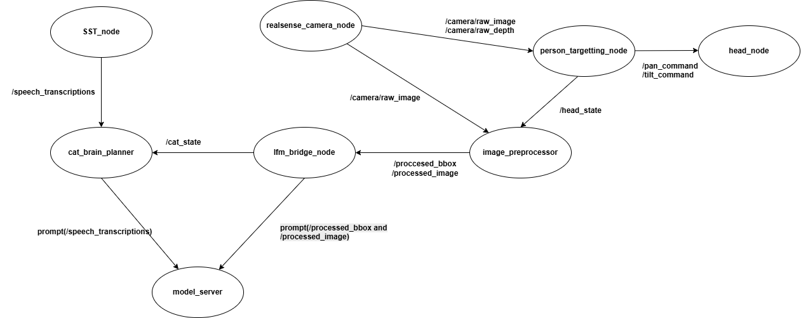

# SudoPsPsPs - Assistive Robot Cat

## Overview

SudoPsPsPs is an assistive robotic cat designed to provide companionship and proactive social interaction. The robot uses a pan-tilt head mechanism, computer vision, speech processing, and a Liquid AI LFM to maintain attention on users and engage in meaningful interactions.

This repository currently contains the head control subsystem, which provides ROS2-based control of a pan-tilt mechanism driven by Dynamixel XL430-W250-T servos through an OpenCR controller.


---

## Hardware

### Pan-Tilt Mechanism

| Component  | Description                   |
| ---------- | ----------------------------- |
| Pan Servo  | Dynamixel XL430-W250-T (ID 1) |
| Tilt Servo | Dynamixel XL430-W250-T (ID 2) |
| Controller | OpenCR                        |
| Interface  | USB Serial                    |
| Protocol   | Dynamixel Protocol 2.0        |

### Sensor Suite (Planned)

* Intel RealSense Camera
* Microphone Array
* Speaker

---

## Software Architecture

System architecture:



The System is designed, in which ROS2 (Robot Operating System 2) nodes control the robot. The central nodes, cat_brain_planner and lfm_bridge_node, have interfaces to the LFM model, to which it can send data from the other ROS2 nodes for the prompt.

Communication Diagram


| Component  | Responsibility                  |
| ---------- | ----------------------------- |
| Lenovo AI Laptop  | Runs the model_server.py that is responsible for running all the LFMs. |
| Lenovo LOQ Laptop | Contains ROS2 nodes responsible for the control of the robot and data collection. |
| Ethernet | Sends data from the robot's sensors connected to the Lenovo LOQ Laptop and sends them to the Lenovo AI Laptop |

Note: This setup is only for the LFM competition because of the requirement to use the Lenovo AI Laptop for inference. Because we use ROS2 as a middleware, all components can actually run on a single device (ex: Laptop and microcontrollers). 

---

# Components

## Dynamixel Driver

File:

```text
dynamixel_driver.py
```

Responsibilities:

* OpenCR communication
* Dynamixel Protocol 2.0 interface
* Torque enable/disable
* Position control
* Startup calibration
* Angle-to-position conversion
* Safety limits

Features:

* Automatic startup calibration
* Current servo position becomes logical zero
* Degree-based control interface
* Servo abstraction layer

Example:

```python
driver.set_pan(30)
driver.set_tilt(-10)
```

---

## Head Node

File:

```text
head_node.py
```

Responsibilities:

* ROS2 integration
* Target angle subscriptions
* Motion smoothing
* Hardware abstraction

Subscribed Topics:

```text
/head/pan_target
/head/tilt_target
```

Message Type:

```python
std_msgs/msg/Float32
```

Example:

```bash
ros2 topic pub --once \
/head/pan_target \
std_msgs/msg/Float32 \
"{data: 30.0}"
```

---

## Startup Calibration

At startup the current servo positions are stored as the robot's neutral pose.

Example:

```text
=== ZERO CALIBRATION ===
Pan Zero  : 2061
Tilt Zero : 3812
========================
```

This allows development without requiring a fixed mechanical home position.

---

# Current Status

Completed:

* [x] Dynamixel communication
* [x] OpenCR integration
* [x] Servo calibration
* [x] Pan control
* [x] Tilt control
* [x] ROS2 head node
* [x] Topic-based head control
* [x] Motion smoothing
* [x] Head tracker node
* [x] Person targeting node
* [x] RealSense integration
* [x] Liquid AI LFM integration
* [x] Speech-to-text node
* [x] User state assessment
* [x] Conversation management
* [x] Assistive check-in behaviors

---

# Development Roadmap

## Phase 1 - Head Control [COMPLETED]

Goal:

* Reliable pan-tilt control through ROS2

Status:

Completed

---

## Phase 2 - Visual Tracking [COMPLETED]

Components:

* head_tracker_node
* person_targeting_node

Goal:

* Follow a selected user
* Maintain visual attention

---

## Phase 3 - Social Intelligence [COMPLETED]

Components:

* STT Node
* lfm_bridge_node

Goal:

* Understand user conversations
* Assess engagement and user state
* Generate appropriate responses

---

## Phase 4 - Assistive Companion Behaviors [COMPLETED]

Goal:

* Proactive check-ins
* Long-term interaction context
* Emotion-aware conversation
* Natural companion behaviors

---

# Quick Start

Build:

```bash
colcon build
source install/setup.bash
```

Run Head Node:

```bash
ros2 run sudo_pspsps head_node
```

Move Head:

```bash
ros2 topic pub --once \
/head/pan_target \
std_msgs/msg/Float32 \
"{data: 30.0}"
```

Return Home:

```bash
ros2 topic pub --once \
/head/pan_target \
std_msgs/msg/Float32 \
"{data: 0.0}"
```

---

# Team Vision

The goal of SudoPsPsPs is to create a robotic companion capable of maintaining attention, understanding conversational context, and proactively checking in on users through natural interaction. Rather than simply reacting to commands, the robot aims to act as a supportive social presence powered by multimodal perception and Liquid AI reasoning.
